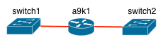

# ASR9k REP-AG PVID Inconsistency

## Описание проблемы

Рассмотрим следующий сценарий:

* На коммутаторе switch1 настроен VLAN10.
* На коммутаторе switch2 настроен VLAN20.
* На ASR9k собирается bridge-domain.



Ниже приведены соответствующие настройки ASR9000.

```text
l2vpn
 bridge group bg1
  bridge-domain bd1
   interface TenGigE0/0/0/0.10
   !
   interface TenGigE0/0/0/1.20
  !
 !
!
interface TenGigE0/0/0/0.10 l2transport
 encapsulation dot1q 10
 rewrite ingress tag pop 1 symmetric
!
interface TenGigE0/0/0/1.20 l2transport
 encapsulation dot1q 20
 rewrite ingress tag pop 1 symmetric
```

В этой ситуации на обоих коммутаторах сработает `%SPANTREE-2-RECV_PVID_ERR`, а порты, с которых получены BPDU, будут заблокированы протоколом STP для соответствующих VLAN.

Это происходит потому, что в BPDU протокола PVST+ передается номер VLAN. В соответствии с алгоритмом работы PVST+ поля dot1q и PVID должны быть равны — таким образом реализуется защита от неправильных конфигураций и потенциальных петель. В приведенной схеме switch1 получит BPDU с dot1q=10, PVID=20, на коммутаторе switch2 наоборот: dot1q=20, PVID=10.

Данное поведение является ожидаемым и соответствует RFC.

## Рекомендованное решение проблемы

Рекомендованным решением проблемы является фильтрация PVST+ BPDU на точках подключения сервисов. Т. к. настройка подразумевает применение ACL ко всем L2 sub-interface, предлагается использовать функционал Flexible CLI для массовой автоматической конфигурации.

### Настройка ACL

```text
ethernet-services access-list ACL-BLOCK-BPDU
 10 deny any host 0100.0ccc.cccd
 90 permit any any
```

### Настройка наследуемой группы конфигурации

Используемое регулярное выражение `.*Gig.*\..*` соответствует всем TenGigagitEthernet и GigabitEthernet L2 sub-интерфейсам.

```text
group BLOCK-BPDU
 interface '.*Gig.*\..*' l2transport
  ethernet-services access-group ACL-BLOCK-BPDU ingress
  ethernet-services access-group ACL-BLOCK-BPDU egress
 !
end-group
```

### Применение конфигурации group

Конфигурация группы применяется в режиме глобальной конфигурации.

```text
RP/0/RSP0/CPU0:ASR-LAB(config)#apply-group BLOCK-BPDU
RP/0/RSP0/CPU0:ASR-LAB(config)#commit
```

### Контроль применения конфигурации

По умолчанию наследуемые команды не отображаются при выводе running-config. Для отображения необходимо использовать дополнительное ключевое слово `inheritance`.

```text
RP/0/RSP0/CPU0:ASR-LAB#sh run int Gig0/1/0/38.110 inheritance
Tue Jun 27 10:39:23.728 MSK
interface GigabitEthernet0/1/0/38.110 l2transport
 encapsulation dot1q 110
 rewrite ingress tag pop 1 symmetric
 ethernet-services access-group ACL-BLOCK-BPDU ingress
 ethernet-services access-group ACL-BLOCK-BPDU egress
```

При добавлении ключевого слово `detail` в выводе running-config добавляется название группы, от которой унаследована конфигурация.

```text
RP/0/RSP0/CPU0:ASR-LAB#sh run int Gig0/1/0/38.110 inheritance detail
Tue Jun 27 10:41:55.697 MSK
interface GigabitEthernet0/1/0/38.110 l2transport
 encapsulation dot1q 110
 rewrite ingress tag pop 1 symmetric
 ## Inherited from group BLOCK-BPDU
 ethernet-services access-group ACL-BLOCK-BPDU ingress
 ## Inherited from group BLOCK-BPDU
 ethernet-services access-group ACL-BLOCK-BPDU egress
```

### Контроль работы REPAG

ACL также применяется на untagged EFP, на который поступают STP TCN, информирующие ASR9000 об аварии на REP сегменте. В native VLAN коммутаторы Cisco используют другой DST MAC address, поэтому TCN будут доставлены корректно.

```text
show spanning-tree repag 1 topology-change flushes
show spanning-tree repag 1
```

Например, из вывода команды видно, когда был получен последний TCN.

```text
RP/0/RSP0/CPU0:ASR-LAB#show spanning-tree repag 1 topology-change flushes
Tue Jun 27 10:52:48.076 MSK


MSTI 0 (CIST):

Interface     Last TC               Reason                           Count
------------  --------------------  -------------------------------- -----
Gi0/1/0/38    18:17:01 Jun 26 2017  Gi0/1/0/38.1 ingress TCN            18
```

```text
RP/0/RSP0/CPU0:ASR-LAB#show spanning-tree repag 1
Tue Jun 27 10:54:07.568 MSK
GigabitEthernet0/1/0/38.1
  Pre-empt delay is disabled
  Name:                0896:ad38:44be
  Revision:            0
  Max Age:             20
  Provider Bridge:     no
  Bridge ID:           0896.ad38.44be
  Port ID:             1
  External Cost:       0
  Hello Time:          2
  Active:              yes
  Packets sent:        66022
  Auto-configure edge: yes
  MSTI 0 (CIST):
    VLAN IDs:         1-4094
    Role:             Designated
    Bridge Priority:  32768
    Port Priority:    128
    Cost:             0
    Root Bridge:      0896.ad38.44be
    Root Priority:    32768
    Topology Changes: 18
```

