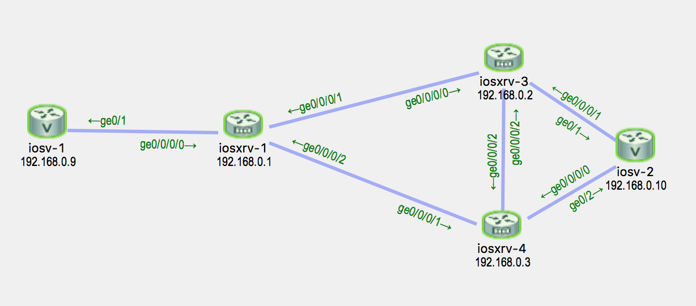

# BGP Graceful Maintenance

Every time you do maintenance you start with moving traffic out of affected box. There are several methods for link state IGPs:

1. OSPF Stub router
2. ISIS overload bit

There are no gracefull techniques for EIGRP and BGP. You can shutdown BGP peers, yes. But we'll talk about [BGP Gracefull Mainenance](http://www.cisco.com/c/en/us/td/docs/routers/asr9000/software/asr9k_r5-3/general/release/notes/reln-532a9k.html#concept_8267A3B6A4C745B78C6AF4D1C64E9DA1) intruduced in IOS XR 5.3.2.

> **Quote** **BGP Graceful Maintenance**
>
> When a BGP link or router is taken down, other routers in the network find alternative paths for the traffic that was flowing through the failed router or link, if such alternative paths exist. The time required before all routers involved can reach a consensus about an alternate path is called convergence time. During convergence time, traffic that is directed to the router or link that is down is dropped. The BGP Graceful Maintenance feature allows the network to perform convergence before the router or link is taken out of service. The router or link remains in service while the network reroutes traffic to alternative paths. Any traffic that is yet on its way to the affected router or link is still delivered as before. After all traffic has been rerouted, the router or link can safely be taken out of service.

Let's configure this.

## Initial setup



### iosv-1 — CE router with OSPF as PE-CE

iosv-1 and iosv-2 are CEs for vrf TEST. iosv-1 uses OSPF as PE-CE protocol.

```text
iosv-1#sh ip route ospf
...
      192.168.0.0/32 is subnetted, 2 subnets
O E2     192.168.0.10 [110/1] via 10.1.128.1, 00:13:33, GigabitEthernet0/1
```

### iosv-2 — CE router with eBGP as PE-CE

iosv-2 uses eBGP as PE-CE protocol. The best path to iosv-1 Loopback address 192.168.0.9/32 is 10.1.0.1. This is the address of iosxrv-3.

```text
iosv-2#sh ip bgp | b Netw
     Network          Next Hop            Metric LocPrf Weight Path
 *   10.1.128.0/30    10.1.0.5                               0 1 ?
 *>                   10.1.0.1                               0 1 ?
 *   192.168.0.9/32   10.1.0.5                               0 1 ?
&&& *>                   10.1.0.1                               0 1 ?
 *>  192.168.0.10/32  0.0.0.0                  0         32768 i
```

### iosxrv-1 — PE router

```text
RP/0/0/CPU0:iosxrv-1#sh route vrf TEST
...
C    10.1.128.0/30 is directly connected, 00:21:35, GigabitEthernet0/0/0/0
L    10.1.128.1/32 is directly connected, 00:21:35, GigabitEthernet0/0/0/0
O    192.168.0.9/32 [110/2] via 10.1.128.2, 00:20:50, GigabitEthernet0/0/0/0
B    192.168.0.10/32 [200/0] via 192.168.0.2 (nexthop in vrf default), 00:25:38
```

### iosxrv-3 — primary PE router

iosxrv-3 — primary PE router. By default it sets local\_preference to 200 for iosv-2 routes.

```text
RP/0/0/CPU0:iosxrv-3#sh bgp vrf TEST | be Netw
Tue May 16 08:33:24.457 UTC
   Network            Next Hop            Metric LocPrf Weight Path
Route Distinguisher: 1:1 (default for vrf TEST)
*>i10.1.128.0/30      192.168.0.1              0    100      0 ?
*>i192.168.0.9/32     192.168.0.1              2    100      0 ?
&&&*> 192.168.0.10/32    10.1.0.2                 0    200      0 100 i

Processed 3 prefixes, 3 paths
```

### iosxrv-4 — backup PE router

iosxrv-4 does not modify any BGP attributes. Because of high local\_preference received from iosxrv-3 it uses 192.168.0.2 as a nexhop for iosv-2 Loopback address 192.168.0.10/32.

```text
RP/0/0/CPU0:iosxrv-4#sh bgp vrf TEST | be Netw
Tue May 16 08:34:21.034 UTC
   Network            Next Hop            Metric LocPrf Weight Path
Route Distinguisher: 1:1 (default for vrf TEST)
*>i10.1.128.0/30      192.168.0.1              0    100      0 ?
*>i192.168.0.9/32     192.168.0.1              2    100      0 ?
*  192.168.0.10/32    10.1.0.6                 0             0 100 i
&&&*>i                   192.168.0.2              0    200      0 100 i

Processed 3 prefixes, 4 paths
```

## Enabling BGP Gracefull Maintenance

By default if you just enable BGP Graceful Maintenance BGP will set GSHUT community attribute to it's updates. If other routers do not interpret it there will not be any action taken by devices.

### Enable BGP graceful maintenance on iosxrv-3

```text
hostname iosxrv-3
!
router bgp 1
 graceful-maintenance activate all-neighbors
```

iosxrv-3 re-announce then prefixes with GSHUT community. We have a corresponding debug bgp updates output from iosxrv-1:

```text
bgp[1052]: [default-rtr] (vpn4u): Received UPDATE from 192.168.0.2 with attributes:
bgp[1052]: [default-rtr] (vpn4u): nexthop 192.168.0.2/32, origin i, localpref 200, metric 0, path 100, community graceful-shutdown, extended community RT:1:1
bgp[1052]: [default-rtr] (vpn4u): Received prefix 2ASN:1:1:192.168.0.10/32 (path ID: none) with MPLS label 24004 from neighbor 192.168.0.2
```

We don't interpret GSHUT community on iosxrv-1. That's why nothing changed except GSHUT community itself.

```text
RP/0/0/CPU0:iosxrv-1#sh bgp vrf TEST 192.168.0.10/32
Tue May 16 08:45:23.128 UTC
BGP routing table entry for 192.168.0.10/32, Route Distinguisher: 1:1
Versions:
  Process           bRIB/RIB  SendTblVer
  Speaker                 45          45
Last Modified: May 16 08:41:58.644 for 00:03:24
Paths: (1 available, best #1)
  Not advertised to any peer
  Path #1: Received by speaker 0
  Not advertised to any peer
  100
    192.168.0.2 (metric 2) from 192.168.0.2 (192.168.0.2)
      Received Label 24004
      Origin IGP, metric 0, localpref 200, valid, internal, best, group-best, import-candidate, imported
      Received Path ID 0, Local Path ID 0, version 45
&&&      Community: graceful-shutdown
      Extended community: RT:1:1
      Source AFI: VPNv4 Unicast, Source VRF: TEST, Source Route Distinguisher: 1:1
```

If we just send GSHUT community we must interpret it. For example we could have used a policy like this:

```text
route-policy gshut
  if community matches-any gshut then
    set local-preference 0
  endif
  pass
end-policy
```

### Adjusting attributes

We can change the attributes for re-announced routes. These changes are set per neighbor.

```text
router bgp 1
 neighbor 192.168.0.1
  graceful-maintenance
   local-preference 0
   as-prepends 2
  !
 !
!
```

Not very scalable untill you read [IOS XR Flexible CLI](flexible-cli.md) article. We'll use a group configuration to accomplish this task.

```text
group BGP-GRACEFUL-MAINTENANCE
 router bgp '[0-9]*'
  neighbor '[0-9]*\.[0-9]*\.[0-9]*\.[0-9]*'
   graceful-maintenance
    local-preference 0
   !
  !
  vrf '([^\s]+)'
   neighbor '[0-9]*\.[0-9]*\.[0-9]*\.[0-9]*'
    graceful-maintenance
     as-prepends 2
    !
   !
  !
 !
end-group
```

And then apply this group:

```text
RP/0/0/CPU0:iosxrv-3(config)#apply-group BGP-GRACEFUL-MAINTENANCE
RP/0/0/CPU0:iosxrv-3(config)#commit
```

Configuration for all neighbors changed:

```text
RP/0/0/CPU0:iosxrv-3#sh run router bgp inheritance
Tue May 16 09:03:21.224 UTC
router bgp 1
 graceful-maintenance activate all-neighbors
 bgp router-id 192.168.0.2
 address-family vpnv4 unicast
 !
 neighbor 192.168.0.1
  remote-as 1
&&&  graceful-maintenance
&&&   local-preference 0
  !
  description iBGP peer iosxrv-1
  update-source Loopback0
  address-family vpnv4 unicast
  !
 !
 neighbor 192.168.0.3
  remote-as 1
&&&  graceful-maintenance
&&&   local-preference 0
  !
  update-source Loopback0
  address-family vpnv4 unicast
  !
 !
 vrf TEST
  rd 1:1
  address-family ipv4 unicast
  !
  neighbor 10.1.0.2
   remote-as 100
&&&   graceful-maintenance
&&&    as-prepends 2
   !
   address-family ipv4 unicast
    route-policy bgp_in in
    route-policy bgp_out out
   !
  !
 !
```

```text
bgp[1052]: [default-rtr] (vpn4u): Received UPDATE from 192.168.0.2 with attributes:
bgp[1052]: [default-rtr] (vpn4u): nexthop 192.168.0.2/32, origin i, localpref 0, metric 0, path 100, community graceful-shutdown, extended community RT:1:1
bgp[1052]: [default-rtr] (vpn4u): Received prefix 2ASN:1:1:192.168.0.10/32 (path ID: none) with MPLS label 24004 from neighbor 192.168.0.2
```

and

```text
bgp[1052]: [default-rtr] (vpn4u): Received UPDATE from 192.168.0.3 with attributes:
bgp[1052]: [default-rtr] (vpn4u): nexthop 192.168.0.3/32, origin i, localpref 100, metric 0, path 100, extended community RT:1:1
bgp[1052]: [default-rtr] (vpn4u): Received prefix 2ASN:1:1:192.168.0.10/32 (path ID: none) with MPLS label 24003 from neighbor 192.168.0.3
```

Now new best path is choosen:

```text
RP/0/0/CPU0:iosxrv-1#sh bgp vrf TEST | b Netw
Tue May 16 09:09:05.871 UTC
   Network            Next Hop            Metric LocPrf Weight Path
Route Distinguisher: 1:1 (default for vrf TEST)
*> 10.1.128.0/30      0.0.0.0                  0         32768 ?
*> 192.168.0.9/32     10.1.128.2               2         32768 ?
&&&* i192.168.0.10/32    192.168.0.2              0      0      0 100 i
&&&*>i                   192.168.0.3              0    100      0 100 i

Processed 3 prefixes, 4 paths
```

But what happened to iosv-2, our CE router? No surprises. We see prepends and bestpath is changed.

```text
iosv-2#sh ip bgp | be Netw
     Network          Next Hop            Metric LocPrf Weight Path
 *>  10.1.128.0/30    10.1.0.5                               0 1 ?
 *                    10.1.0.1                               0 1 1 1 ?
&&& *>  192.168.0.9/32   10.1.0.5                               0 1 ?
&&& *                    10.1.0.1                               0 1 1 1 ?
 *>  192.168.0.10/32  0.0.0.0                  0         32768 i
```

## Links

* [Implementing BGP](http://www.cisco.com/c/en/us/td/docs/routers/asr9000/software/asr9k_r5-3/routing/configuration/guide/b_routing_cg53xasr9k/b_routing_cg53xasr9k_chapter_010.html)

