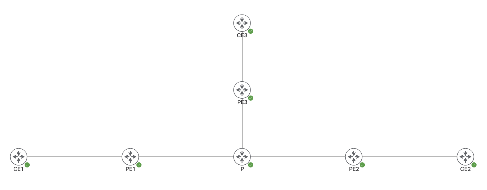

# IOS XR mVPN Profile 14


Make sure your software version supports mVPN Profile 14.


## Topology



1. C-RP is configured on PE2: 21.21.21.21. All other router have C-RP statically defined.

## Configuration

mVPN configuration is identical for all PEs.


Only mVPN relevant configuration is listed below.




```aspnet
hostname PE1
!
vrf A
 vpn id 1:1
 address-family ipv4 unicast
  import route-target
   1:1
  !
  export route-target
   1:1
  !
 !
!
interface Loopback0
 ipv4 address 1.1.1.1 255.255.255.255
!
interface GigabitEthernet0/0/0/0
 description to GigabitEthernet0/0.CE1
 vrf A
 ipv4 address 192.168.1.1 255.255.255.0
!
interface GigabitEthernet0/0/0/1
 description to GigabitEthernet0/0/0/1.P
 ipv4 address 10.0.101.1 255.255.255.0
!
route-policy PASS
  pass
end-policy
!
route-policy mVPN-Profile-14
  set core-tree mldp-partitioned-p2mp
end-policy
!
router ospf 1
 router-id 1.1.1.1
 area 0
  mpls ldp auto-config
  interface Loopback0
   passive enable
  !
  interface GigabitEthernet0/0/0/1
   network point-to-point
  !
 !
!
router bgp 1
 bgp router-id 1.1.1.1
 address-family vpnv4 unicast
 !
 address-family ipv4 mvpn
 !
 neighbor 2.2.2.2
  remote-as 1
  update-source Loopback0
  address-family vpnv4 unicast
  !
  address-family ipv4 mvpn
  !
 !
 neighbor 3.3.3.3
  remote-as 1
  update-source Loopback0
  address-family vpnv4 unicast
  !
  address-family ipv4 mvpn
  !
 !
 vrf A
  rd auto
  address-family ipv4 unicast
   redistribute connected
  !
  address-family ipv4 mvpn
  !
  neighbor 192.168.1.2
   remote-as 2
   address-family ipv4 unicast
    route-policy PASS in
    route-policy PASS out
    as-override
   !
  !
 !
!
mpls ldp
 mldp
  address-family ipv4
  !
 !
 router-id 1.1.1.1
!
multicast-routing
 address-family ipv4
  interface Loopback0
   enable
  !
 !
 vrf A
  address-family ipv4
   mdt source Loopback0
   rate-per-route
   interface all enable
   accounting per-prefix
   bgp auto-discovery mldp
   !
   mdt partitioned mldp ipv4 p2mp
   mdt data 100
  !
 !
!
router pim
 vrf A
  address-family ipv4
   rpf topology route-policy mVPN-Profile-14
   mdt c-multicast-routing bgp
   !
   rp-address 21.21.21.21
   interface GigabitEthernet0/0/0/0
    enable
   !
  !
 !
!
end
```



```text
hostname PE2
!
vrf A
 vpn id 1:1
 address-family ipv4 unicast
  import route-target
   1:1
  !
  export route-target
   1:1
  !
 !
!
interface Loopback0
 ipv4 address 2.2.2.2 255.255.255.255
!
interface Loopback100
 description VRF-A RP
 vrf A
 ipv4 address 21.21.21.21 255.255.255.255
!
interface GigabitEthernet0/0/0/0
 description to GigabitEthernet0/0.CE2
 vrf A
 ipv4 address 192.168.2.1 255.255.255.0
!
interface GigabitEthernet0/0/0/2
 description to GigabitEthernet0/0/0/2.P
 ipv4 address 10.0.102.2 255.255.255.0
!
route-policy PASS
  pass
end-policy
!
route-policy mVPN-Profile-14
  set core-tree mldp-partitioned-p2mp
end-policy
!
router ospf 1
 router-id 2.2.2.2
 area 0
  mpls ldp auto-config
  interface Loopback0
   passive enable
  !
  interface GigabitEthernet0/0/0/2
   network point-to-point
  !
 !
!
router bgp 1
 bgp router-id 2.2.2.2
 address-family vpnv4 unicast
 !
 address-family ipv4 mvpn
 !
 neighbor 1.1.1.1
  remote-as 1
  update-source Loopback0
  address-family vpnv4 unicast
  !
  address-family ipv4 mvpn
  !
 !
 neighbor 3.3.3.3
  remote-as 1
  update-source Loopback0
  address-family vpnv4 unicast
  !
  address-family ipv4 mvpn
  !
 !
 vrf A
  rd auto
  address-family ipv4 unicast
   redistribute connected
  !
  address-family ipv4 mvpn
  !
  neighbor 192.168.2.2
   remote-as 2
   address-family ipv4 unicast
    route-policy PASS in
    route-policy PASS out
    as-override
   !
  !
 !
!
mpls ldp
 mldp
  address-family ipv4
  !
 !
 router-id 2.2.2.2
!
multicast-routing
 address-family ipv4
  interface Loopback0
   enable
  !
 !
 vrf A
  address-family ipv4
   mdt source Loopback0
   rate-per-route
   interface all enable
   accounting per-prefix
   bgp auto-discovery mldp
   !
   mdt partitioned mldp ipv4 p2mp
   mdt data 100
  !
 !
!
router pim
 vrf A
  address-family ipv4
   rpf topology route-policy mVPN-Profile-14
   mdt c-multicast-routing bgp
   !
   rp-address 21.21.21.21
   interface GigabitEthernet0/0/0/0
    enable
   !
  !
 !
!
end
```



```
hostname PE3
!
vrf A
 vpn id 1:1
 address-family ipv4 unicast
  import route-target
   1:1
  !
  export route-target
   1:1
  !
 !
!
interface Loopback0
 ipv4 address 3.3.3.3 255.255.255.255
!
interface GigabitEthernet0/0/0/0
 description to GigabitEthernet0/0.CE3
 vrf A
 ipv4 address 192.168.3.1 255.255.255.0
!
interface GigabitEthernet0/0/0/3
 description to GigabitEthernet0/0/0/3.P
 ipv4 address 10.0.103.3 255.255.255.0
!
route-policy PASS
  pass
end-policy
!
route-policy mVPN-Profile-14
  set core-tree mldp-partitioned-p2mp
end-policy
!
router ospf 1
 router-id 3.3.3.3
 area 0
  mpls ldp auto-config
  interface Loopback0
   passive enable
  !
  interface GigabitEthernet0/0/0/3
   network point-to-point
  !
 !
!
router bgp 1
 bgp router-id 3.3.3.3
 address-family vpnv4 unicast
 !
 address-family ipv4 mvpn
 !
 neighbor 1.1.1.1
  remote-as 1
  update-source Loopback0
  address-family vpnv4 unicast
  !
  address-family ipv4 mvpn
  !
 !
 neighbor 2.2.2.2
  remote-as 1
  update-source Loopback0
  address-family vpnv4 unicast
  !
  address-family ipv4 mvpn
  !
 !
 vrf A
  rd auto
  address-family ipv4 unicast
   redistribute connected
  !
  address-family ipv4 mvpn
  !
  neighbor 192.168.3.2
   remote-as 2
   address-family ipv4 unicast
    route-policy PASS in
    route-policy PASS out
    as-override
   !
  !
 !
!
mpls ldp
 mldp
  address-family ipv4
  !
 !
 router-id 3.3.3.3
!
multicast-routing
 address-family ipv4
  interface Loopback0
   enable
  !
 !
 vrf A
  address-family ipv4
   mdt source Loopback0
   rate-per-route
   interface all enable
   accounting per-prefix
   bgp auto-discovery mldp
   !
   mdt partitioned mldp ipv4 p2mp
   mdt data 100
  !
 !
!
router pim
 vrf A
  address-family ipv4
   rpf topology route-policy mVPN-Profile-14
   mdt c-multicast-routing bgp
   !
   rp-address 21.21.21.21
   interface GigabitEthernet0/0/0/0
    enable
   !
  !
 !
!
end
```



```
hostname P
!
interface Loopback0
 ipv4 address 10.10.10.10 255.255.255.255
!
interface GigabitEthernet0/0/0/1
 description to GigabitEthernet0/0/0/1.PE1
 ipv4 address 10.0.101.10 255.255.255.0
!
interface GigabitEthernet0/0/0/2
 description to GigabitEthernet0/0/0/2.PE2
 ipv4 address 10.0.102.10 255.255.255.0
!
interface GigabitEthernet0/0/0/3
 description to GigabitEthernet0/0/0/3.PE3
 ipv4 address 10.0.103.10 255.255.255.0
!
router ospf 1
 router-id 10.10.10.10
 area 0
  mpls ldp auto-config
  interface Loopback0
   passive enable
  !
  interface GigabitEthernet0/0/0/1
   network point-to-point
  !
  interface GigabitEthernet0/0/0/2
   network point-to-point
  !
  interface GigabitEthernet0/0/0/3
   network point-to-point
  !
 !
!
mpls ldp
 mldp
  address-family ipv4
  !
 !
 router-id 10.10.10.10
!
end
```





```text
hostname CE1
!
interface Loopback0
 ip address 192.168.0.1 255.255.255.255
 ip pim sparse-mode
 ip igmp join-group 232.1.1.1 source 192.168.2.2
 ip igmp version 3
!
interface Loopback1
 ip address 192.168.101.1 255.255.255.255
 ip pim sparse-mode
 ip igmp join-group 239.1.1.2
!
interface GigabitEthernet0/0
 description to GigabitEthernet0/0/0/0.PE1
 ip address 192.168.1.2 255.255.255.0
 ip pim sparse-mode
!
router bgp 2
 bgp log-neighbor-changes
 neighbor 192.168.1.1 remote-as 1
 !
 address-family ipv4
  redistribute connected
  neighbor 192.168.1.1 activate
 exit-address-family
!
ip pim rp-address 21.21.21.21
ip pim ssm range 1
!
access-list 1 permit 232.0.0.0 0.255.255.255
!
end
```



```
hostname CE2
!
interface GigabitEthernet0/0
 description to GigabitEthernet0/0/0/0.PE2
 ip address 192.168.2.2 255.255.255.0
 ip pim sparse-mode
 duplex auto
 speed auto
 media-type rj45
!
router bgp 2
 bgp log-neighbor-changes
 neighbor 192.168.2.1 remote-as 1
 !
 address-family ipv4
  neighbor 192.168.2.1 activate
 exit-address-family
!
ip pim rp-address 21.21.21.21
!
end
```



```

```



## PE-CE used SSM

### No receivers, no active sources

```text

```

### Active receiver, no active sources

```text

```

### No receivers, there's an active source

```text

```

## PE-CE uses ASM

### No receivers, no active sources

```text

```

### Active receiver, no active sources

```text

```

### No receivers, there's an active source

```text

```

## mVPN interoperability issues

Several vendors depending on a software version are using pre-RFC encoding for `C-Mcast Import RT`. In this case you won't find a correct extended community in VPNv4 updates. Instead there will be \_\_\_\_\_\_\_.

#### Wrong encoding

Below you can find CLI to switch to RFC encoding.



```text

```



```

```




